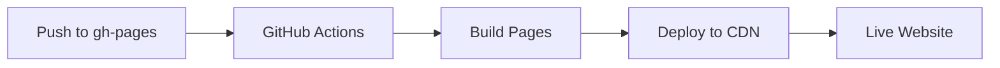

# GitHub Pages Deployment Guide

## Website URL

🌐 **https://0xrem.github.io/agent-firewall/**

## Architecture

The website is hosted on GitHub Pages using the `gh-pages` branch:

```
agent-firewall/
├── main branch          # Python source code
├── gh-pages branch      # Static website (HTML/CSS/JS)
└── .github/
    └── workflows/
        └── deploy-pages.yml  # Auto-deploy on push
```

## Manual Deployment

If you need to manually update the website:

```bash
# 1. Checkout gh-pages branch
git checkout gh-pages

# 2. Edit website files
# - index.html
# - styles.css
# - app.js

# 3. Commit and push
git add -A
git commit -m "feat: Update website"
git push origin gh-pages
```

## Automatic Deployment

The GitHub Actions workflow automatically deploys when:
- Files change in `gh-pages` branch
- Manual trigger via GitHub Actions UI

## Enable GitHub Pages

1. Go to **Settings** → **Pages**
2. Under **Build and deployment**:
   - **Source**: Deploy from a branch
   - **Branch**: `gh-pages` → `/ (root)`
3. Click **Save**

Your site will be live at: `https://0xrem.github.io/agent-firewall/`

## Custom Domain (Optional)

To use a custom domain:

1. Add `CNAME` file to `gh-pages` branch:
   ```
   firewall.agent.dev
   ```

2. Configure DNS with your domain provider:
   ```
   CNAME firewall.agent.dev 0xrem.github.io
   ```

3. Update GitHub Pages settings with your custom domain

## CI/CD Pipeline



## Troubleshooting

### Site not updating

1. Check GitHub Actions workflow status
2. Clear browser cache (Ctrl+Shift+R)
3. Verify `gh-pages` branch is selected in Settings

### 404 Error

Wait 1-2 minutes after first deployment. GitHub Pages needs time to provision.

### Build fails

Check `.github/workflows/deploy-pages.yml` for errors in Actions tab.

## Local Preview

Test the website locally before pushing:

```bash
# Using Python's built-in server
cd /path/to/gh-pages-branch
python -m http.server 8000

# Open browser to http://localhost:8000
```

## Security Notes

- Website is static HTML/CSS/JS only
- No server-side code execution
- All content versioned in git
- Deployments require push to `gh-pages` branch
